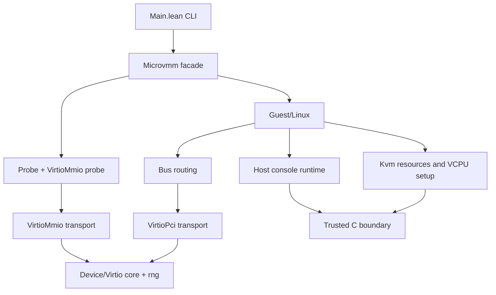

# Architecture

This document describes the current stable subsystem shape.

## Trusted boundary

In this repository, "trusted boundary" means the smallest code we currently rely on without proving it.

- `ffi/shim.c` plus `Microvmm/FFI.lean` form the low-level boundary.
- That boundary does raw host work only: KVM file descriptors and ioctls, guest-memory allocation and registration, `kvm_run` mapping, packed guest-memory reads and writes, Unix socket and stdio helpers, wake-timer helpers, and the tiny embedded guest blob used by the standalone virtio-mmio probe.
- It does not decide Linux boot layout, virtio queue rules, transcript readiness, or proof statements.
- Lean code above the boundary validates inputs, chooses guest layout, routes exits, models device state, and turns raw failures into named diagnostics.

## Layering

## Subsystems

- Facades and CLI: `Main.lean`, `Microvmm.lean`, and compatibility facades accept user requests and preserve a stable top-level import surface.
- Guest Linux planning: `Microvmm/Guest/Linux/Image.lean` validates bzImage inputs, `Plan.lean` builds a pure boot plan, and `Microvmm/Kvm/VcpuSetup.lean` applies guest-agnostic protected-mode setup policy.
- Guest Linux runtime: `Runtime.lean`, `Console.lean`, and `Platform.lean` run the bounded KVM exit loop, track transcript readiness, and manage interactive handoff.
- Bus routing: `Bus/Mmio.lean`, `Bus/Pci.lean`, and `Bus/Platform.lean` decide whether an exit is passive platform behavior, serial/UART behavior, or device transport traffic.
- Device semantics: `Device/Virtio/Core.lean` owns shared virtio queue and status transitions, while `Device/Virtio/Rng.lean` owns deterministic entropy completion.
- Transport adapters: `VirtioMmio.lean` and `VirtioPci.lean` translate MMIO or PCI register traffic into the shared virtio core instead of re-implementing device logic twice.
- Host interaction: `Host/...` contains serial replay state, client queues, socket or stdio transport, and wake-timer plumbing.
- Proof surface: `Microvmm/Proof/...` imports implementation modules and states browseable invariants without feeding proof dependencies back into runtime code.

## High-level data and control flow

1. The executable turns raw CLI arguments into validated request types. Invalid combinations, such as interactive boot without an initrd, are rejected before the runtime path starts.
2. For Linux boot, the image layer parses the bzImage and optional initrd, then the planning layer produces a list of typed boot writes instead of mutating guest memory ad hoc.
3. The KVM layer allocates guest memory, creates the VM and VCPU, applies the protected-mode setup, and enters a bounded `KVM_RUN` loop.
4. Each exit is routed by concern: serial I/O stays in the Linux console subsystem, passive platform accesses are handled in the bus layer, and virtio traffic is forwarded through the transport adapter into the shared device model.
5. The host layer mirrors serial output to stdio or socket and log transports. Readiness for probe success or interactive handoff is latched from guest transcript markers.
6. Proof modules talk about the pure boot plan, serial protocol state, replay bounds, and console runtime queues without changing runtime behavior.

## Why the proof tree is separate

`Microvmm/Proof/` exists so a reviewer can browse proof statements without first stepping through KVM plumbing or host I/O. The import direction is intentionally one-way: implementation modules may be imported by proof modules, but implementation code does not depend on proof modules.

## Related documents

- [Proof engineer guide](proof-engineer-guide.md)
- [Build and run](build-and-run.md)
- [Module map](module-map.md)
- [Proof roadmap](proof-roadmap.md)
- [Guest Linux guide](guest-linux.md)
- [Virtio guide](virtio.md)